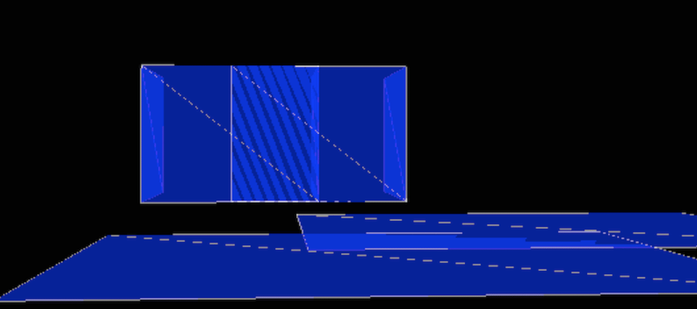

# bounding volume hierarchy 
Brute force collision detection is an O(n2) operation. A bounding volume hierarchy (BVH) is an abstract tree structure on a set of geometric primitives that helps speed up collision detection. By arranging its leaves to contain geometric primitives and grouping the non leaf nodes in bounding volumes, a BVH tree reduces the time complexity of collision detection to O(nlogn). With such a hierarchy, children volumes are not examined if their parents do not intersect.

Construction of a BVH proceeds by partitioning the input set into two (or more) subsets. Each subset is then bounded in a bounding volume and recursively partitioned (and bounded) until each subset consists of only a single geometric primitive. 

This implementation z fighting in the scene depicted above by using a BVH to detect overlaps between geometric primitives. The construction and search operation are performed using a stack as in practice it works faster than the recursive approach.

Note: Requires Eigen 3.2.4 and assumes it is in /usr/local/Cellar/eigen/3.2.4/include/eigen3/
